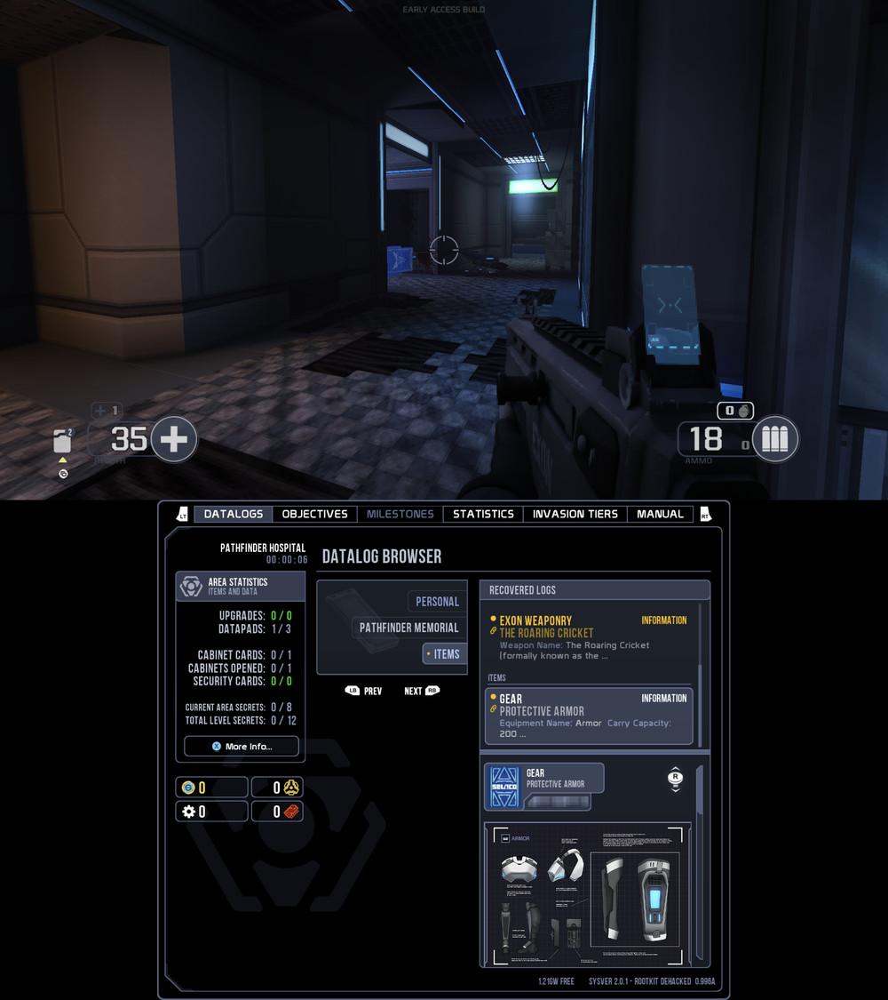

# Selaco for Android and macOS

An unofficial port of [Selaco](https://store.steampowered.com/app/1592280/Selaco/) to
**Android** and **macOS**, built on the Selaco engine (itself a GZDoom fork).

Tested on an **AYN Thor** (Snapdragon 8 Gen 2, Android 13) and on Apple Silicon Macs.

**You need to own Selaco.** No game data is included — you bring your own
`Selaco.ipk3` from your Steam install.

---

## Install on Android

[](https://apps.obtainium.imranr.dev/redirect?r=obtainium://app/%7B%22id%22%3A%22com.selaco.game%22%2C%22url%22%3A%22https%3A%2F%2Fgithub.com%2Fdanillogical%2FGZSelaco-android%22%2C%22author%22%3A%22danillogical%22%2C%22name%22%3A%22Selaco%22%2C%22preferredApkIndex%22%3A0%2C%22additionalSettings%22%3A%22%7B%5C%22includePrereleases%5C%22%3Afalse%2C%5C%22fallbackToOlderReleases%5C%22%3Atrue%2C%5C%22filterReleaseTitlesByRegEx%5C%22%3A%5C%22%5C%22%2C%5C%22filterReleaseNotesByRegEx%5C%22%3A%5C%22%5C%22%2C%5C%22verifyLatestTag%5C%22%3Afalse%2C%5C%22sortMethodChoice%5C%22%3A%5C%22date%5C%22%2C%5C%22useLatestAssetDateAsReleaseDate%5C%22%3Afalse%2C%5C%22releaseTitleAsVersion%5C%22%3Afalse%2C%5C%22trackOnly%5C%22%3Afalse%2C%5C%22versionExtractionRegEx%5C%22%3A%5C%22%5C%22%2C%5C%22matchGroupToUse%5C%22%3A%5C%22%5C%22%2C%5C%22versionDetection%5C%22%3Atrue%2C%5C%22releaseDateAsVersion%5C%22%3Afalse%2C%5C%22useVersionCodeAsOSVersion%5C%22%3Afalse%2C%5C%22apkFilterRegEx%5C%22%3A%5C%22%5C%22%2C%5C%22invertAPKFilter%5C%22%3Afalse%2C%5C%22autoApkFilterByArch%5C%22%3Atrue%2C%5C%22appName%5C%22%3A%5C%22%5C%22%2C%5C%22appAuthor%5C%22%3A%5C%22danillogical%5C%22%2C%5C%22about%5C%22%3A%5C%22%5C%22%2C%5C%22refreshBeforeDownload%5C%22%3Afalse%2C%5C%22includeZips%5C%22%3Afalse%2C%5C%22zippedApkFilterRegEx%5C%22%3A%5C%22%5C%22%7D%22%2C%22overrideSource%22%3Anull%7D)

[Obtainium](https://github.com/ImranR98/Obtainium) installs the APK from this repo's releases and
updates it when a new one comes out. Or do step 1 by hand; the rest is the same either way.

1. Download `Selaco-android-<version>.apk` from [Releases](../../releases) and install it.
2. Find `Selaco.ipk3` in your Steam folder:
   `steamapps/common/Selaco/Selaco.ipk3` (~1.2 GB)
3. Copy it to **`Internal storage/Selaco/`** on your device — the folder your file manager
   shows as "Internal storage", i.e. `/sdcard/Selaco/`. USB, an SD card or a download on the
   device all work.
4. Launch Selaco. It asks for file access — tap **Allow access to manage all files**, then
   reopen it.

   This is what lets the game read the `Selaco.ipk3` you just copied, since it sits outside
   the app's own private folder, and it lets your savegames live in `Selaco/savegames/` where
   they survive uninstalling or updating the app. Android has no narrower permission that
   covers this: the media-only permission cannot read an `.ipk3`, and anything the app can
   reach without asking is deleted along with the app.
5. Pick your device in the first-run dialog: **AYN Thor**, **AYN Odin 2**, **AYN Odin**, or
   one of the two Steam Deck presets. That one choice sets your graphics preset, the
   handheld UI and control defaults, and — on the Thor — turns the second screen on.

You can change device later in **Options → Handhelds → Reset Device Choice**, which
restarts the game and asks again.

**Requirements:** Vulkan 1.1+ (there is no OpenGL fallback) and **a gamepad** — touch
controls are not implemented, so a device with no physical buttons cannot play.

## The second screen (AYN Thor)



Open your PDA with the codex button and the bottom screen becomes the live codex,
gamepad-driven; close it and it goes back to the standby codex, which keeps the tab you
were last on and refreshes when you find a secret or hit a milestone.

Two settings in **Options → Handhelds**:

| setting | what it does |
|---|---|
| **Second Screen** | turns the lower panel on or off entirely |
| **Second Screen Size** | how large the codex is drawn, 1.00–2.00. Default **1.75** |

Sizes above about 1.8 start cutting the tab strip off at both ends, because the codex is
laid out for a 1920-wide screen and the panel is 1240 wide.

## Other handhelds

**AYN Odin 2** gets the Thor's settings without the second screen. **AYN Odin** (first
generation) gets a lighter graphics preset, since it is the weakest of the three.

**Neither has been tested on hardware** — only the Thor has. The profiles are a considered
starting point, not a verified one, and if a device picks the wrong preset the fix is a text
file rather than a code change: see [`profiles/README.md`](profiles/README.md), which
documents every setting and how to add a device. Pull requests adding or retuning one are
welcome.

**Updating:** install the new APK *over* the old one — that keeps your settings and key
bindings, which live in the app's private storage and are the one thing an uninstall does
destroy. Your savegames are safer: they live in `Internal storage/Selaco/savegames/`
alongside the `Selaco.ipk3`, so they survive uninstalling, reinstalling, or clearing the
app's storage.

## Install on macOS

Apple Silicon (arm64), macOS 11+. There is no pre-built download — you compile it:

```bash
./macos/build-deps.sh     # dependencies
./macos/build-macos.sh    # the engine
./macos/package-macos.sh  # -> build-macos-arm64/Selaco.app
```

Put `Selaco.ipk3` in `gamedata/full/` and run `./macos/run-macos.sh`. Mouse, keyboard
and Xbox controllers all work.

---

## Reporting a problem

**If it crashes,** just relaunch and keep playing — crash details are saved
automatically and each crash is appended to the same file, so nothing is lost.

Send us **`Internal storage/Selaco/selaco-ea-crash.log`** — the same folder as your
game data. Note roughly when it happened and what you were doing; timestamps in the
file are UTC.

**If it feels choppy,** open the console (`~` on a keyboard, or the on-screen keyboard)
and type:

```
fpsdips
```

That prints how many frames ran below 26 fps while you played, and the worst one.
`fpsdips reset` starts the count over. Include that with any performance report, along
with your graphics preset.

---

## Optional: a faster graphics driver (Turnip)

Adreno devices can use Mesa's open-source Turnip driver instead of Qualcomm's. On the
Thor it measured about **8% faster** with no loss of image quality.

1. Download a Turnip build for your device (MrPurple's and stevenmx's both work).
2. Extract the driver and **rename it to `vulkan.so`**.
3. Put it in **`Internal storage/Selaco/`**, next to your game data.

It is picked up automatically on the next launch. To go back, delete `vulkan.so`.

> **Experimental.** This is an unofficial driver. If a level fails to load or the game
> crashes, delete `vulkan.so` and it reverts to the system driver.

---

## Known gaps

- **No touch controls.** A gamepad is required on Android.
- **Vulkan only** — no OpenGL fallback.
- **Only the AYN Thor has been tested.** The Odin 2, Odin and Steam Deck profiles are
  reasoned from Selaco's own presets but have never run on that hardware. In particular
  the single-screen path — everything the Thor never exercises, because it always has a
  second display — is unverified.
- **No pre-built macOS release.** Build it yourself.
- Heavy combat can still dip below 30 fps on the Thor.

---

## For developers

Build instructions, the Android storage and permission model, the second screen's
design, performance measurements and the patches carried against upstream are in
**[TECHNICAL.md](TECHNICAL.md)**. [CLAUDE.md](CLAUDE.md) covers the traps that bite
while working in the tree. Device profiles live in [`profiles/`](profiles/) and are
plain text — [`profiles/README.md`](profiles/README.md) documents every key. Graphics
profiles used for testing are in `android/configs/`.

---

## License and credits

GPL v3, inherited from GZDoom.

- GZDoom — © 1998-2023 ZDoom + GZDoom teams and contributors
- Doom source — © 1997 id Software, Raven Software and contributors
- Selaco and the Selaco engine — Altered Orbit Studios / TheCockatrice

Selaco is a commercial game and is **not** distributed here.

[zdoom.org](https://zdoom.org/) · [wiki](https://zdoom.org/wiki/) ·
[forum](https://forum.zdoom.org/) · [Discord](https://dsc.gg/zdoom)
